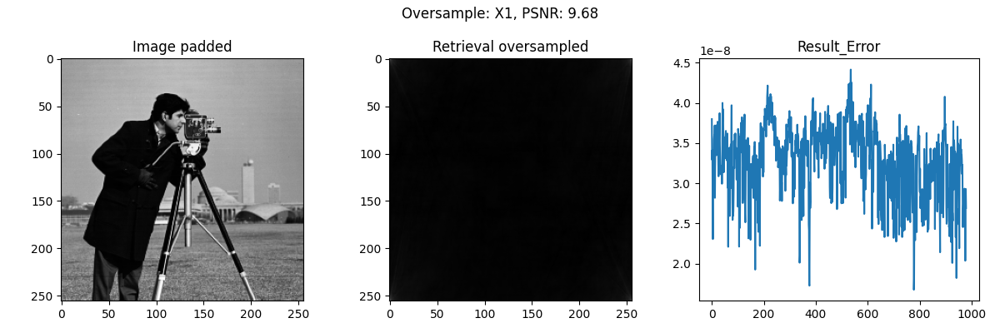
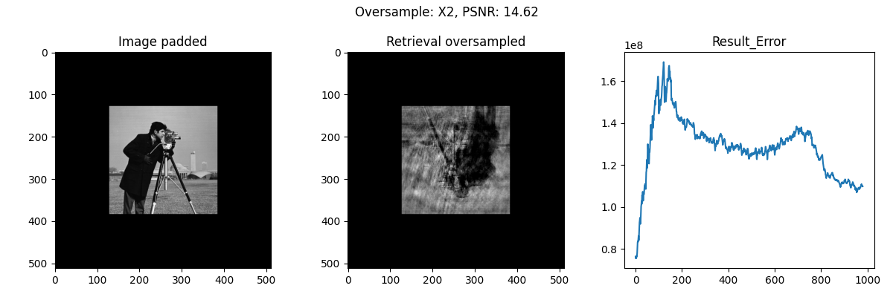
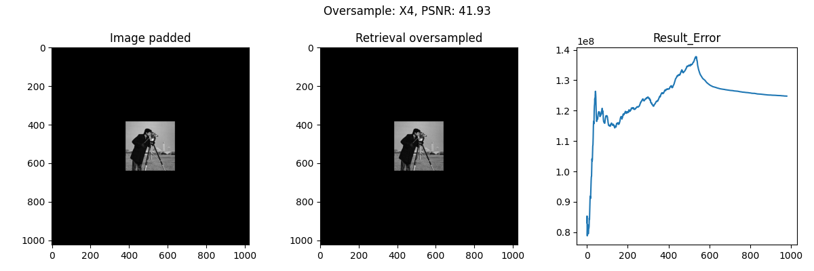

# Phase Retrieval Algorithm (Python/Matlab)

Matlab/Python Implementation of simple iterative optimization phase retrieval algorithm of Fienup type (HIO/ER).

* GPU accelerating is applied under cupy with 10x speed increase , if installed. 

## Algorithm
Phase recovery algorithm: Input the Fourier transformed amplitude of the two-dimensional grayscale image, and achieve image reconstruction through <b>reprojection and domain constraints</b> without the need for phase. Phase recovery algorithms are widely used in `coherent diffraction imaging`, `intensity interference imaging`, `scattering imaging` and other fields.

Fienup-type phase recovery algorithms are also divided into different algorithms according to their spatial domain constraints. The more common ones are Error-Reduction (ER) and Hybrid-Input-Output (HIO) algorithms. The object space constraints of the ER algorithm are as shown in the formula, where $\gamma$ represents the prior physical constraints of the object space, that is, the image of the object space needs to be non-negative and real. Pixels that do not satisfy the physical constraint are set to zero, and pixels that satisfy the constraint are retained.

<b>Update strategy of Error-Reduction algorithm</b>

$
	O'_j(x,y)=
	\left\{
	\begin{array}{lr}
	O_j(x,y), &  (x,y)\in \gamma \\
		0, & (x,y)\notin \gamma\\
	\end{array}
	\right.
$

<b>Update strategy of Hybrid-Input-Output algorithm</b>

$
	O\prime_j(x,y)=
	\left\{
	\begin{array}{lr}
		O_j(x,y), &  (x,y)\in \gamma \\
		O\prime_{j-1}(x,y)-\beta O_j(x,y), & (x,y)\notin \gamma\\
	\end{array}
	\right.
$

## Run
### Python

* Phase retrieval with HIO oversample ×1,×2 and ×4 :

	`python test_phase_retrieval_oversample.py` 

* Benchmark of between `Numpy` and `cupy`:

	`python benchmark.py`

### Matlab

* Run script `Run_Phase_Retrieval.m` in Matlab

## Result
* Oversample ratio ×1, ×2 and ×4

* Run in Matlab

## Link
https://github.com/tuelwer/phase-retrieval