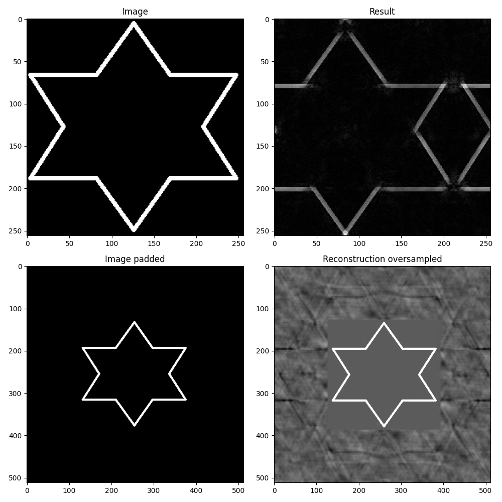
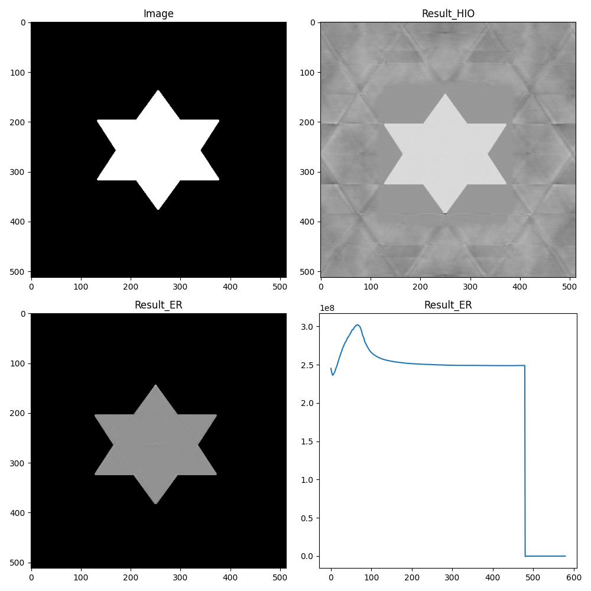
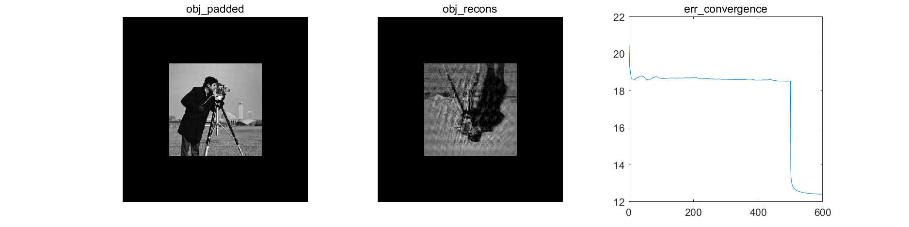

# Fienup型相位恢复算法（Python/Matlab）

## 算法原理
相位恢复算法：输入二维灰度图像的傅里叶变换后的振幅，在不需要相位的情况下，通过<b>重投影和域约束的方法</b>实现图像重建。相位恢复算法广泛应用于`相干衍射成像`、`强度干涉成像`、`散射成像`等领域。

Fienup型相位恢复算法根据其空间域约束的不同也分为不同的算法，比较常见的有Error-Reduction（ER）和Hybrid-Input-Output（HIO）算法。ER算法的物空间约束如式所示，其中$\gamma$表示物空间的先验物理约束，即物体空间的图像需要为非负而且为实数。对于不满足该物理约束的部分的像素置零，满足约束的部分得到保留。

Update strategy of Error-Reduction algorithm
$$
	O'_j(x,y)=
	\left\{
	\begin{array}{lr}
	O_j(x,y), &  (x,y)\in \gamma \\
		0, & (x,y)\notin \gamma\\
	\end{array}
	\right.
$$

Update strategy of Hybrid-Input-Output algorithm

$$
	O\prime_j(x,y)=
	\left\{
	\begin{array}{lr}
		O_j(x,y), &  (x,y)\in \gamma \\
		O\prime_{j-1}(x,y)-\beta O_j(x,y), & (x,y)\notin \gamma\\
	\end{array}
	\right.
$$
## 运行
* Python
	```
	python example_oversampling.py
	```
* Matlab
	
	Matlab中直接运行Run_Phase_Retrieval.m


## 结果

* <center><b>图像padding对重建结果的影响(example_oversampling.py)</b></center>




* <center><b>算法收敛(example_convergence.py)</b></center>




* <center><b>Matlab实现(Run_Phase_Retrieval.m)</b></center>




## 参考
https://github.com/tuelwer/phase-retrieval